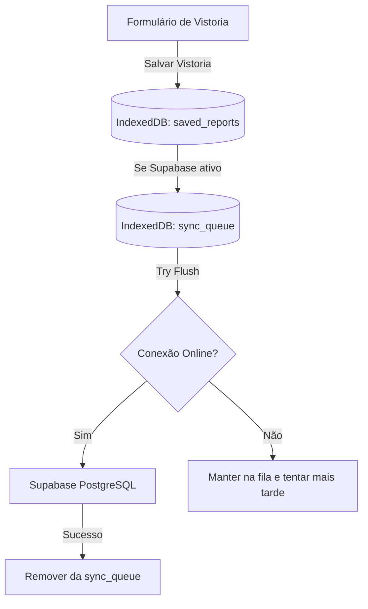

# Danos Aparentes — Plataforma Brasileira de Inteligência Histórica Veicular

O **Danos Aparentes** é a plataforma de Inteligência Histórica Veicular que cria a **memória digital permanente** de cada veículo. Inspeções inteligentes, evidências digitais, linha do tempo, análise por IA e dossiês técnicos profissionais — offline-first, com sincronização na nuvem.

---

## Recursos Principais

### 1. Mapas Interativos de Danos (SVG)
- Mapeamento vetorial interativo em 4 vistas (Lateral Esquerda, Lateral Direita, Frontal, Traseira).
- Suporte a 5 tipos de silhuetas: **Automóvel**, **Motocicleta**, **Caminhão**, **Van/Utilitário** e **Ônibus**.
- Registro de danos com classificação de severidade (Leve, Média, Grave) pintando dinamicamente os componentes do veículo no mapa e no dossiê em PDF.

### 2. Assinatura Digital Integrada (Canvas)
- Captura de assinatura digital na tela (responsável e cliente) via Pointer Events.
- Assinaturas embutidas como imagens Base64 PNG no dossiê técnico.

### 3. Digitação por Voz (Speech-to-Text)
- Digitação por voz nativa (Web Speech API) para Observações Gerais e Notas de Danos.

### 4. Gestão e Busca do Histórico (IndexedDB)
- Armazenamento local robusto em IndexedDB (100% offline).
- Busca por proprietário, placa, modelo e número de OS.
- Download direto do dossiê PDF a partir do histórico salvo.

### 5. Sincronização em Nuvem (Supabase)
- Arquitetura offline-first com fila de sincronização (`sync_queue`).
- Políticas RLS para que cada usuário acesse apenas o próprio histórico.

---

## 📁 Estrutura de Pastas

```text
├── docs/                      # Arquivos de documentação do sistema
├── public/                    # Ícones do PWA e arquivos públicos estáticos
├── supabase/                  # Estrutura SQL de migração e RLS do Supabase
│   └── schema.sql             # Definição das tabelas, índices e triggers
├── src/
│   ├── app/                   # Roteamento e páginas principais (Next.js App Router)
│   │   ├── app/page.tsx       # Tela principal do sistema (Nova Vistoria / Estatísticas)
│   │   └── verify/            # Página pública de verificação de autenticidade (QR Code)
│   ├── components/            # Componentes React reutilizáveis
│   │   ├── vehicles/          # Silhuetas e diagramas técnicos em SVG dos veículos
│   │   ├── DashboardView.tsx  # Painel de estatísticas, métricas e KPIs
│   │   ├── SavedReportsModal.tsx # Histórico de relatórios, pesquisa e download de PDF
│   │   ├── SignaturePad.tsx   # Painel de captura de assinatura digital
│   │   └── SpeechButton.tsx   # Componente de reconhecimento de voz
│   ├── hooks/                 # Hooks de estado customizados (useDamages, useSavedReports, etc.)
│   ├── lib/                   # Utilitários globais (IndexedDB, PDF Generator, Sync)
│   │   ├── db.ts              # Interface de escrita/leitura do IndexedDB
│   │   ├── pdf.ts             # Gerador de relatórios PDF (com layout compacto de 1 página)
│   │   └── sync.ts            # Sincronizador local/nuvem do Supabase
│   └── types.ts               # Tipagens TypeScript estritas do projeto
```

---

## 🚀 Como Iniciar

### Pré-requisitos
- Node.js (versão 18 ou superior)
- NPM (gerenciador de pacotes)

### Instalação de Dependências
Na raiz do projeto, instale as dependências executando:
```bash
npm install
```

### Desenvolvimento Local (Turbopack)
Inicie o servidor de desenvolvimento rápido utilizando o script utilitário ou o comando npm:
```bash
# Executando via script utilitário do Windows:
dev.bat

# Ou diretamente no terminal:
npm run dev
```
O aplicativo estará disponível em `http://localhost:3000`.

### Build de Produção
Para verificar a conformidade dos tipos e compilar uma build de produção otimizada:
```bash
npm run build
```

---

## 🔄 Fluxo de Sincronização (Fila de Sync)

O aplicativo utiliza uma fila local de operações para persistência resiliente.



---

## 🛠️ Tecnologias Utilizadas
- **Framework**: Next.js 16 (Turbopack)
- **Biblioteca de Interface**: React 19
- **Estilização**: Tailwind CSS & CSS Vanilla
- **Banco de Dados Local**: IndexedDB
- **Banco de Dados Remoto**: Supabase (PostgreSQL)
- **Gerador de PDF**: Biblioteca customizada leve e responsiva
