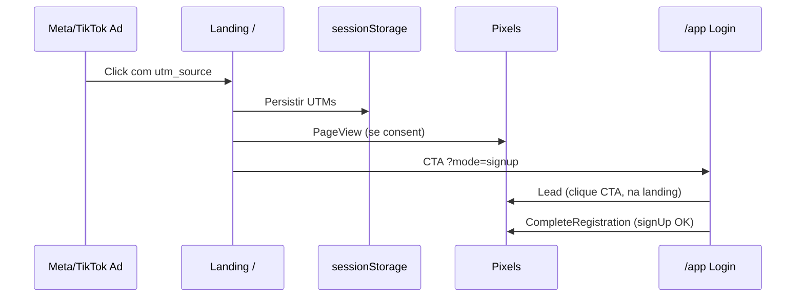

# Design: Landing Otimizada para Anúncios (Meta + TikTok) e Conversão

**Data:** 2026-06-23  
**Status:** Aprovado (aguardando revisão do spec)  
**Escopo:** Landing mobile-first para tráfego pago Meta/TikTok, pixels de conversão e fluxo de cadastro medível. Sem Google Ads, sem variantes A/B, sem SEO/blog nesta fase.

## Problema

O produto tem landing completa (`src/app/page.tsx`) com hero rotativo, seções longas (veículos, PDF, pricing, FAQ) e CTAs para `/app`. O gargalo declarado pelo negócio é **pouco tráfego**, com plano de aquisição via **anúncios pagos em Meta e TikTok** (não Google Ads).

Sem pixels de conversão dedicados e sem landing enxuta para mobile, campanhas pagas não conseguem:
- Otimizar para cadastro (só clique ou pageview genérico)
- Comparar Meta vs TikTok com confiança
- Reduzir abandono no primeiro segundo (hero rotativo + IntroVideo + página longa)

## Objetivo

Aumentar **cadastros atribuíveis** vindos de Meta/TikTok, medindo o funil:

```
Anúncio → Landing (/) → CTA → /app (signup) → Conta criada → Trial 7 dias
```

## Decisões de produto (brainstorm)

| Decisão | Escolha |
|---------|---------|
| Prioridade do funil | Cadastros na landing (não retenção/trial→pago nesta fase) |
| Gargalo | Pouco tráfego → resolver com mídia paga |
| Canais | Meta + TikTok (mesma landing; criativos adaptados por rede) |
| Público | Misto (vistoriador, oficina, frota) |
| Escopo | **B:** landing otimizada + pixels + eventos de cadastro |

## Abordagens consideradas

### A — Só landing (descartada)
Melhora copy/UX, mas anúncios ficam “cegos” sem otimização por cadastro.

### B — Landing + pixels ✅ (escolhida)
Equilíbrio ideal: página pronta para tráfego mobile + medição nos painéis Meta/TikTok.

### C — Pacote completo (fase 2)
Variantes A/B, guia de criativos e automação de e-mail ficam para depois de 2–4 semanas de baseline.

---

## Arquitetura

### Funil e responsabilidades

| Etapa | Componente | Responsabilidade |
|-------|------------|------------------|
| Entrada | `src/app/page.tsx` | Hero fixo, CTA único, sticky bar mobile, modo tráfego pago |
| Atribuição | `src/lib/analytics/utm.ts` | Capturar/persistir UTMs em `sessionStorage` |
| Tracking | `src/lib/analytics/pixels.ts` | Meta Pixel + TikTok Pixel; helpers `trackPageView`, `trackLead`, `trackCompleteRegistration` |
| Consentimento | `src/components/CookieConsentBanner.tsx` *(novo)* | Banner LGPD; pixels de marketing só após aceite |
| Cadastro | `src/views/Login.tsx` | Deep link `?mode=signup`; evento pós-`signUp` |
| Layout | `src/app/layout.tsx` | Carregar scripts condicionais (prod + IDs configurados) |

### Fluxo de dados (tracking)



**Nota:** `gtag` Google (`AW-18259031185`) já existe em `layout.tsx` — **mantido**, sem expandir escopo Google Ads.

---

## Seção 1 — Landing para tráfego pago

### Hero

- **Remover carrossel rotativo** (`TextCarousel`) do hero principal; substituir por copy **fixa**.
- **Headline:** “Laudo de avarias no celular em minutos — offline, com PDF e assinatura digital.”
- **Subtexto:** “Teste grátis por 7 dias. Para vistoriadores, oficinas e frotas.”
- **CTA primário único:** “Criar conta grátis” → `/app?mode=signup` (+ UTMs preservados)
- **Micro-prova:** “7 dias grátis · Sem cartão · Funciona offline”

### Header

- Manter “Entrar” secundário (texto)
- CTA header alinhado ao mesmo destino do hero (`/app?mode=signup`)
- Evitar dois CTAs primários com labels diferentes (“Começar Agora” vs “Criar Conta Grátis”) — **unificar copy**

### Sticky CTA (mobile)

- Barra fixa inferior em viewports `< md` com botão “Criar conta grátis”
- Ocultar quando usuário já scrollou até o CTA do hero (IntersectionObserver) para não duplicar visualmente

### Modo tráfego pago

Quando URL contiver `utm_source=meta` ou `utm_source=tiktok` (ou qualquer `utm_*`):

- **Não exibir** `IntroVideo` (menos fricção)
- Hero sobe sem delay de animações pesadas (`motion-reduce` respeitado)
- Opcional: esconder visualizador SVG 3D no mobile (já `hidden lg:block`) — manter

### Seções abaixo do fold

- Manter “Como funciona”, showcase, PDF preview, pricing, FAQ — **não remover**, mas garantir que conversão não dependa de scroll
- Pricing CTA também aponta para `/app?mode=signup`

### Performance mobile

Reutilizar diretrizes do spec `2026-06-20-fluidez-mobile-landing-design.md`:

- Reduzir `backdrop-filter` em `.glass-card` no mobile
- Desligar animações `float` / `bounce-slow` no hero mobile
- Meta/TikTok penalizam LCP alto — priorizar texto + CTA acima do fold

---

## Seção 2 — Pixels e eventos

### Variáveis de ambiente

```env
NEXT_PUBLIC_META_PIXEL_ID=
NEXT_PUBLIC_TIKTOK_PIXEL_ID=
```

Documentar em `.env.example`. Pixels **só carregam** se ID presente **e** `NODE_ENV === 'production'` (ou flag explícita `NEXT_PUBLIC_ANALYTICS_ENABLED=true` para testes).

### Eventos

| Evento interno | Meta | TikTok | Disparo |
|----------------|------|--------|---------|
| `PageView` | PageView | PageView | Mount landing e `/app` |
| `Lead` | Lead | SubmitForm | Clique em CTA primário (landing + pricing) |
| `CompleteRegistration` | CompleteRegistration | CompleteRegistration | `onSignUp` resolve sem erro |

Parâmetros opcionais nos eventos: `utm_source`, `utm_campaign` (lidos de `sessionStorage`).

### Implementação

- Módulo `src/lib/analytics/pixels.ts` — funções puras, guard contra SSR (`typeof window`)
- Componente client `AnalyticsProvider` ou hooks chamados nos pontos de disparo
- Não duplicar PageView em navegações internas desnecessárias

---

## Seção 3 — Fluxo de cadastro (`/app`)

1. CTAs linkam para `/app?mode=signup` preservando query string UTM
2. `Login.tsx` lê `mode=signup` na mount → `useState<Mode>('signup')`
3. Após signup bem-sucedido:
   - Disparar `CompleteRegistration`
   - Mensagem: “Conta criada! Seu teste de 7 dias começou.”
   - Se Supabase exigir confirmação de e-mail, manter fluxo atual + copy clara
4. Disparar `Lead` no **clique** do CTA na landing (antes da navegação), não no mount de `/app`

---

## Seção 4 — Privacidade (LGPD)

- Novo `CookieConsentBanner` na landing (e opcionalmente `/app`)
- Texto curto + link para Política de Privacidade
- Botões: “Aceitar” / “Recusar marketing”
- Preferência em `localStorage` key `cookie_consent_marketing`
- **Sem consentimento:** não carregar Meta/TikTok pixels; PageView orgânico via Vercel Speed Insights permanece
- Atualizar texto legal mencionando Meta/TikTok para medição de campanhas

---

## Seção 5 — UTMs padronizados

Links de anúncios devem usar:

```
https://danosaparentes.com.br/?utm_source=meta&utm_medium=paid&utm_campaign={campanha}
https://danosaparentes.com.br/?utm_source=tiktok&utm_medium=paid&utm_campaign={campanha}
```

Helper `captureUtmParams()` na landing (useEffect once):

- Lê `utm_source`, `utm_medium`, `utm_campaign`, `utm_content`
- Grava em `sessionStorage` se presentes
- CTAs appendam UTMs ao href de `/app` se ainda na query

---

## Fora de escopo

- Google Ads / otimização do tag AW existente
- Múltiplas landings A/B (`/lp/oficina`, etc.)
- Blog, SEO técnico, sitemap expandido
- Guia de criativos Meta/TikTok (fase 2)
- Checkout Stripe no paywall (projeto separado)
- E-mail de nurturing pós-trial

---

## Arquivos afetados

| Arquivo | Mudança |
|---------|---------|
| `src/app/page.tsx` | Hero fixo, sticky CTA, modo paid, CTAs unificados |
| `src/app/layout.tsx` | Scripts pixels condicionais |
| `src/lib/analytics/utm.ts` | *(novo)* Captura UTMs |
| `src/lib/analytics/pixels.ts` | *(novo)* Meta + TikTok events |
| `src/components/CookieConsentBanner.tsx` | *(novo)* Consent LGPD |
| `src/views/Login.tsx` | `mode=signup`, CompleteRegistration |
| `src/components/PricingSection.tsx` | CTA + Lead event |
| `src/components/LegalContent` ou política | Menção pixels |
| `.env.example` | IDs dos pixels |

---

## Critérios de sucesso

| Métrica | Meta inicial (30 dias pós deploy) |
|---------|-----------------------------------|
| Eventos visíveis nos painéis Meta/TikTok | PageView, Lead, CompleteRegistration |
| Atribuição por rede | Comparar cadastros `utm_source=meta` vs `tiktok` |
| Taxa clique CTA → signup iniciado | Estabelecer baseline; meta aspiracional ≥ 15% |
| LCP mobile (landing) | < 2,5s em throttling 4G |
| Rolagem mobile | Sem jank perceptível no hero (herdar critério spec 2026-06-20) |

---

## Testes manuais

1. Landing com `?utm_source=meta` → IntroVideo off, UTMs em sessionStorage  
2. Clique CTA → evento Lead nos pixels (com consent) + navegação `/app?mode=signup`  
3. Signup OK → CompleteRegistration  
4. Recusar cookies → pixels não carregam  
5. Aceitar cookies → pixels carregam; eventos aparecem no Meta Events Manager / TikTok Events  
6. Mobile: sticky CTA visível; hero legível sem scroll  

---

## Fase 2 (backlog)

- Variantes de landing por persona (oficina vs vistoriador)
- Guia de criativos (formatos 9:16, hooks, CTAs)
- Otimização paywall → checkout Stripe in-app
- Dashboard interno de conversão por campanha

---

## Referências

- Spec anterior: `docs/superpowers/specs/2026-06-20-fluidez-mobile-landing-design.md`
- Landing atual: `src/app/page.tsx`
- Auth: `src/views/Login.tsx`
- Trial: trigger Supabase `handle_new_user_trial` (7 dias)
